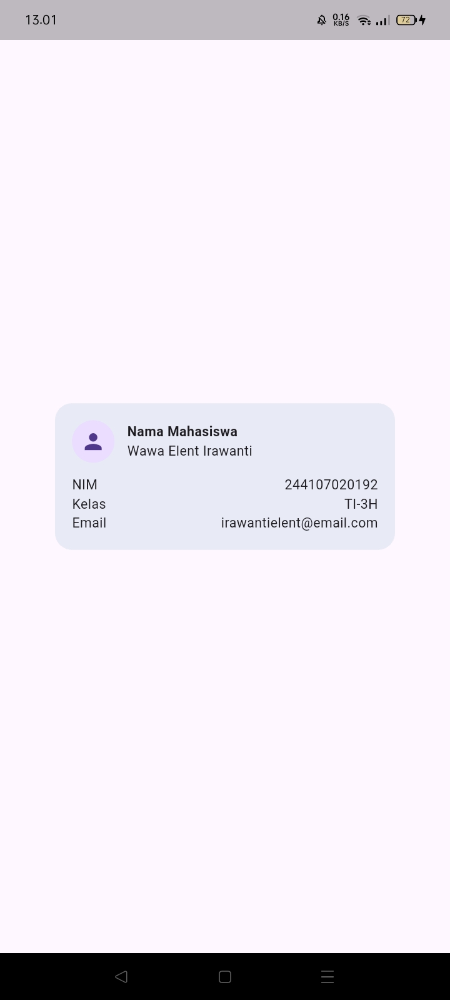
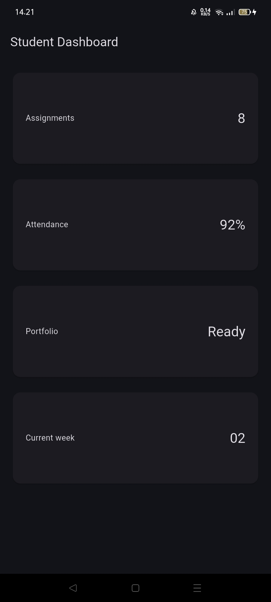
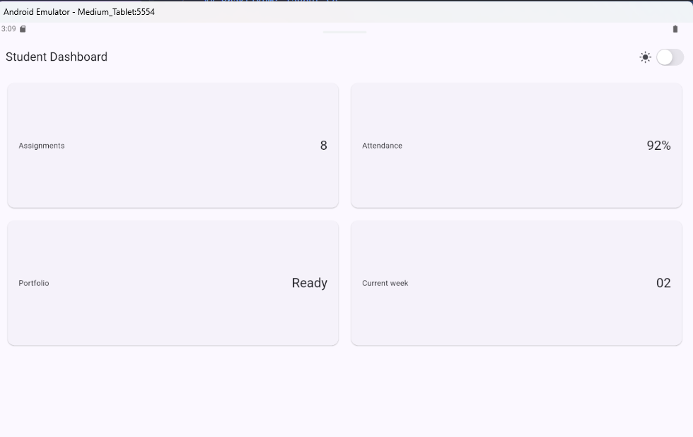
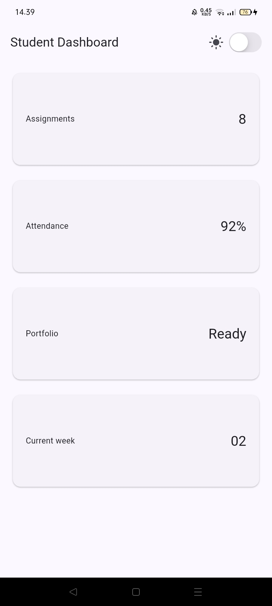
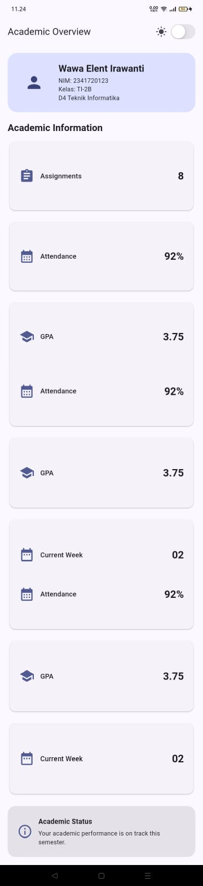
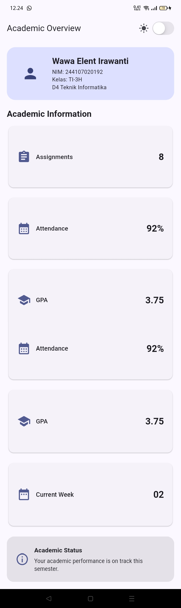
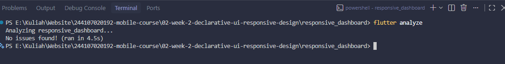
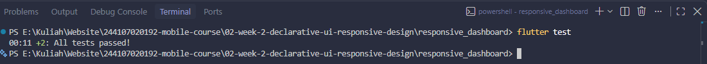
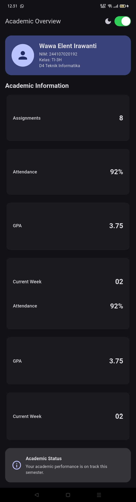

### NAMA : Wawa Elent Irawanti

### NIM : 244107020192

### KELAS : TI-3H

## Praktikum: layout sederhana (warm-up)

### Eksperimen warm-up

1. Hapus Expanded pada baris nama, lalu amati peringatan overflow atau perilaku layout-nya; kembalikan setelah itu.

   = Jika Expanded dihapus, column tidak lagi dipaksa menggunakan ruang yang tersedia. Jika teks terlalu panjang, teks dapat keluar(overflow) dari batas card karena row harus menyesuaikan seluruh isi child.

2. Ganti mainAxisSize: MainAxisSize.min menjadi nilai default dan amati perubahan tinggi kartu.

   = Column akan berusaha menggunakan seluruh tinggi ruang yang tersedia. Akibatnya, tinggi ProfileCard dapat menjadi lebih besar dan tidak lagi hanya mengikuti tinggi isi kontennya.

3. Tambahkan satu baris data (misal Email) menggunakan pola Row + Expanded yang sama.

## Praktikum: dashboard responsif

### Eksperimen layout

<li>Ubah breakpoint dari 700 menjadi nilai lain dan amati perubahan jumlah kolom.
<li>Ubah themeMode menjadi ThemeMode.dark, lalu kembalikan ke ThemeMode.system.
<li>Tambahkan Semantics atau label yang bermakna pada elemen yang penting bagi screen reader.
<li>Uji aplikasi dengan ukuran layar emulator yang berbeda.

<b>Pada Ukuran Tablet</b>

<b>Pada Ukuran Mobile</b>

## Tugas dan AI design exploration

## Tugas utama

Kembangkan dashboard menjadi halaman Academic Overview dengan ketentuan:

<li>Memiliki header profil dan minimal empat kartu informasi.
<li>Menggunakan Row, Column, Expanded, dan Container.
<li>Menampilkan satu kolom pada layar sempit dan dua kolom pada layar lebar.
<li>Menyediakan light theme dan dark theme yang tetap terbaca, dengan toggle tema (misal CupertinoSwitch atau Switch.adaptive).
<li>Memiliki label aksesibilitas untuk informasi atau tombol penting.
<li>Menyertakan screenshot layar sempit dan lebar pada folder screenshots/.

## AI Prompt Challenge

<li>Prompt desain. Ajukan prompt ini (atau variasinya): "Bandingkan dua tata letak dashboard akademik untuk Flutter: versi GridView dan versi LayoutBuilder + Column. Jelaskan trade-off responsif dan aksesibilitasnya."
<li>Prompt penguatan konsep. "Jelaskan kapan penggunaan Expanded justru menyebabkan overflow di dalam Row, beri contoh kode yang gagal dan perbaikannya."
<li>Verification prompt. Minta AI mengaudit hasilnya sendiri: "Periksa kembali rekomendasi layout di atas: apakah tetap responsif di bawah 600px, apakah mengurangi aksesibilitas, dan apakah ada widget yang tidak tersedia di Flutter stabil saat ini?"
<li>Dokumentasikan. Simpan prompt, output penting, keputusan yang dipilih, alasan teknis, dan bukti verifikasi (test/screenshots) di README tugas minggu ini.

Hasil prompt ada di:

📄 [Lihat hasil Prompt](prompt.md)

## Refactoring challenge

<li>Ekstrak kartu informasi menjadi widget reusable (misal InfoCard) yang menerima title dan value, sehingga tidak ada duplikasi widget.
<li>Ganti warna dan ukuran yang di-hardcode dengan Theme.of(context) agar mengikuti tema terang/gelap secara otomatis.
<li>Pindahkan breakpoint ke satu konstanta bernama (misal const kWideBreakpoint = 700;) agar hanya didefinisikan satu kali.
<li>Jalankan flutter analyze dan pastikan tidak ada error maupun warning baru.

## Checklist verifikasi

<li>flutter analyze tidak menghasilkan error.

<li>flutter test lulus semua widget test responsif.

<li>Aplikasi dapat dijalankan pada ukuran layar sempit dan lebar.

<b>Pada Ukuran Mobile</b>

<li>Dark mode memiliki kontras dan teks yang terbaca.

## Refleksi 

<li><b> Apa perbedaan cara berpikir imperative dan declarative saat membangun UI?</b> 
Imperative menjelaskan bagaimana UI dibuat dan diubah langkah demi langkah, sedangkan declarative menjelaskan seperti apa tampilan UI yang diinginkan.</li>

<li><b>Kapan Expanded membantu dan kapan penggunaannya justru menghasilkan layout error?</b> 
Expanded membantu widget mengisi sisa ruang yang tersedia di dalam Row atau Column. Jika digunakan pada ruang yang tidak terbatas atau tidak sesuai, dapat menyebabkan overflow atau layout error.</li>

<li><b>Bagaimana breakpoint dan theme memengaruhi pengalaman pengguna?</b> 
Breakpoint membuat tampilan menyesuaikan ukuran layar, misalnya satu kolom pada HP dan dua kolom pada tablet. Theme membuat aplikasi tetap nyaman digunakan dalam mode terang maupun gelap.</li>

<li><b>Apa yang Anda verifikasi dari rekomendasi AI setelah tugas inti selesai?</b> 
Saya memverifikasi apakah rekomendasi AI dapat diterapkan, tetap responsif pada berbagai ukuran layar, tidak mengganggu aksesibilitas, dan sesuai dengan fitur Flutter yang tersedia.</li>