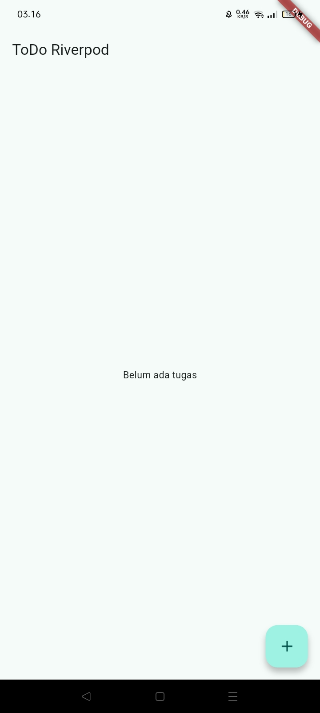
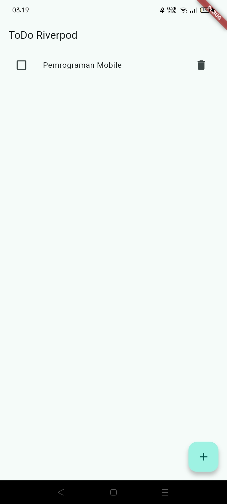
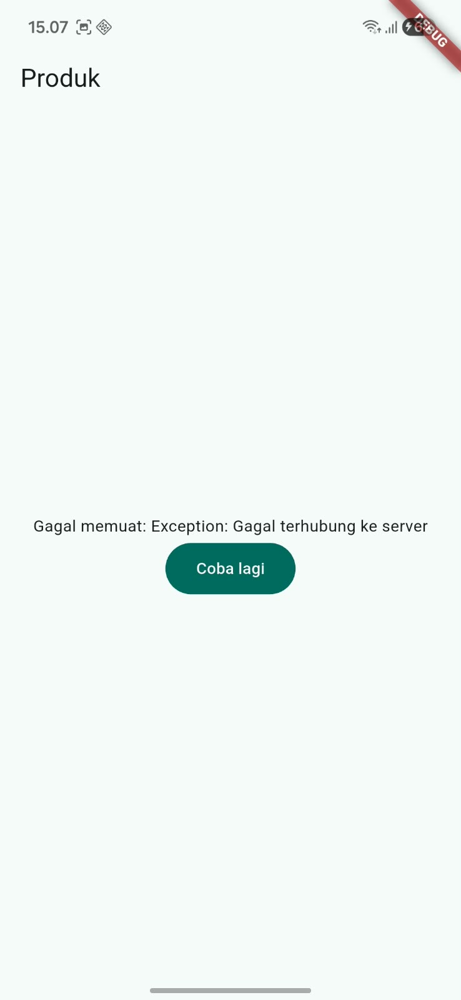
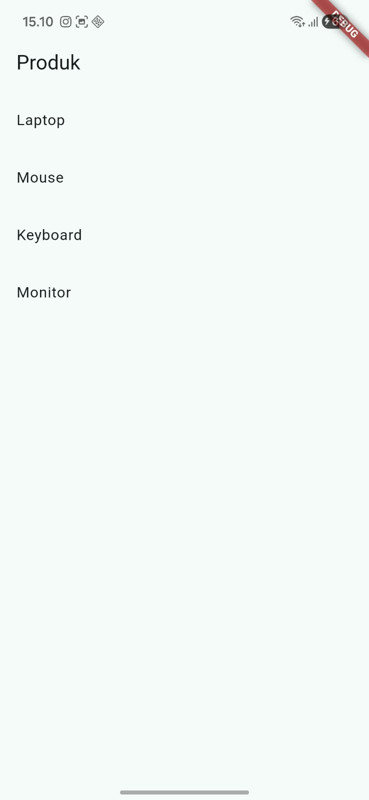
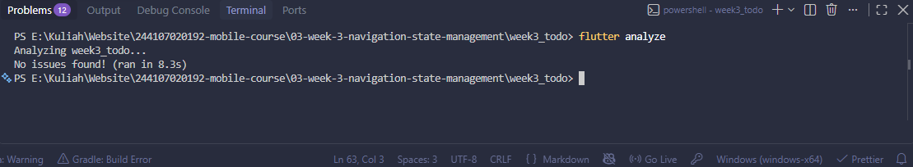
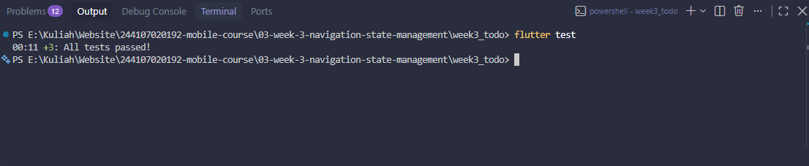
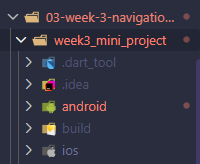
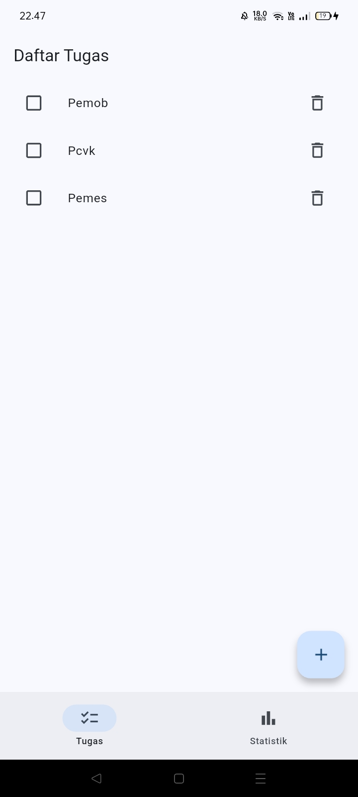
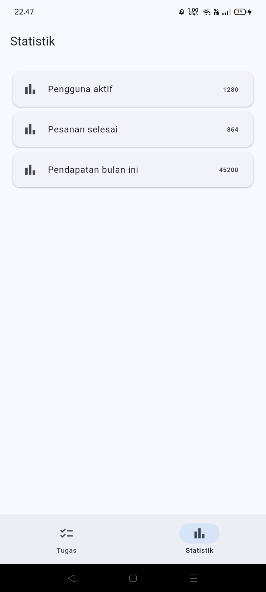

### NAMA : Wawa Elent Irawanti

### NIM : 244107020192

### KELAS : TI-3H

## Praktikum 1: Aplikasi multi-page dengan GoRouter

|                Home Page                |                 Detail Page                 |
| :-------------------------------------: | :-----------------------------------------: |
|  |  |

## Praktikum 2: Aplikasi ToDo dengan Riverpod

|            Sebelum Data Ditambahkan             |             Setelah Data Ditambahkan              |
| :---------------------------------------------: | :-----------------------------------------------: |
|  |  |

## Praktikum 3: Uji ketiga state

1. Salin kode di atas ke project ToDo Anda (atau project terpisah) dan jalankan. Amati tampilan loading selama 2 detik pertama.

   

   
   = Hasil pengamatan: Saat pertama kali dijalankan, muncul indikator loading selama kurang lebih 2 detik. Setelah proses selesai, daftar produk di tampilkan.

2. Ubah build() sementara untuk melempar error: throw Exception('Gagal terhubung ke server');. Jalankan dan amati UI error beserta tombol Coba lagi.

   

   = Setelah build() dibuat melempar error, aplikasi menampilkan pesan kegagalan dan tombol "Coba lagi". Hal ini menunjukkan bahwa state error berhasil ditangani menggunakan AsyncValue.

3. Tekan tombol Coba lagi, ref.invalidate membuat provider dijalankan ulang. Pulihkan kode, pastikan state success tampil.

   

   = Setelah tombol "Coba lagi" ditekan, ref.invalidate() menjalankan kembali productsProvider. Setelah proses selesai, data berhasil dimuat dan daftar produk ditampilkan kembali.

4. Refleksikan: mengapa menampilkan ulang data lama (stale data) dengan indikator refresh kadang lebih baik daripada mengosongkan layar? Kapan pola itu penting?

   = Menampilkan data lama (stale data) dengan indikator refresh lebih baik karena pengguna masih dapat melihat informasi yang tersedia selama data terbaru sedang dimuat. Pola ini penting pada aplikasi yang sering mengambil data dari server agar tampilan tidak kosong dan pengalaman pengguna tetap nyaman.

## AI Verification Checklist

Sebelum kode AI diterima, verifikasi hal berikut dan catat temuan Anda di README:

<li> Apakah state diubah secara immutable (tidak ada state.add() atau mutasi list langsung)?

= Tidak ada state.add() atau mutasi list secara langsung.

<li> Apakah ref.watch hanya dipakai di dalam build, dan ref.read di callback?

= Ya, ref.watch(statsProvider) hanya digunakan di build().

<li> Apakah ketiga state AsyncValue benar-benar ditangani (bukan hanya success)?

= Ya, Ketiga state AsyncValue, yaitu loading, error, dan data, telah ditangani menggunakan when(). State error juga menyediakan mekanisme retry menggunakan ref.invalidate().

<li> Apakah provider dideklarasikan dengan tipe eksplisit dan tidak duplikat dengan provider lain?

= Provider menggunakan tipe eksplisit AsyncNotifierProvider<StatsNotifier, List<Statistic>> dan pada kode yang diperiksa tidak ditemukan provider duplikat.

<li> Apakah kode AI memakai API Riverpod versi lama (StateProvider antipattern, StateNotifierProvider usang, atau Consumer bertingkat yang tidak perlu)? Perbaiki ke pola Notifier/ConsumerWidget.

= Kode sudah menggunakan pola Riverpod modern dengan AsyncNotifier dan ConsumerWidget. Tidak ditemukan penggunaan StateProvider, StateNotifierProvider, atau Consumer bertingkat yang tidak diperlukan.

<li> Jalankan flutter analyze dan flutter test, apakah hasil AI lolos tanpa warning?

= flutter analyze berhasil dijalankan dan tidak ditemukan warning maupun error seperti pada gambar dibawah ini. 

= flutter test berhasil dijalankan dan tidak ditemukan warning maupun error seperti pada gambar dibawah ini.

## Refactoring dan testing

## CheckList verifikasi mandiri

|   |   |
|---|---|
| [✓] | Navigasi GoRouter bekerja: pindah halaman, back, dan akses path detail langsung. |
| [✓] | ProviderScope membungkus root aplikasi; state ToDo bertahan saat berpindah halaman. |
| [✓] | UI AsyncValue menangani loading, error, dan success, bukan hanya success. |
| [✓] | flutter analyze tanpa issue dan semua test lulus. |
| [✓] | Hasil AI diverifikasi dan didokumentasikan pada folder docs/. |
|   |   |

## Tugas, refleksi, dan referensi

## Mini project / Industry Challenge

### Tujuan
<li> Membuat  aplikasi ToDo sederhana dengan navigasi menggunakan GoRouter dan pengelolaan state menggunakan Riverpod.</li>

### Fitur utama
<li> Menampilkan daftar tugas
<li> Menambahkan tugas
<li> Menandai tugas selesai
<li> Menghapus tugas
<li> Halaman Statistik
<li> Navigasi me nggunakan GoRouter
<li> State management menggunakan Riverpod
<li> Simulasi proses asinkron menggunakan AsyncValue
<li> Menampilkan kondisi loading, error, dan success
<li> Widget test dan unit test

### Teknologi 
<li> Flutter
<li> Dart
<li> Riverpod
<li> GoRouter

### Struktur Project

### Implementasi Tugas
| No. | Tugas | Hasil |
|---|---|---|
| 1 | Minimal 2 halaman dengan GoRouter | ✓ Halaman Tugas dan Statistik |
| 2 | State menggunakan Riverpod dan UI `ConsumerWidget` | ✓ Sudah diterapkan |
| 3 | Simulasi asinkron dengan `AsyncValue` | ✓ Loading, error, dan success |
| 4 | Minimal 1 unit/widget test yang lulus | ✓ Widget test dan unit test |
| 5 | AI Challenge | ✓ Prompt, hasil AI, perbaikan, dan alasan teknis |
| 6 | Repository dan README | ✓ Struktur project dan dokumentasi tersedia |
|   |   |   |

### Cara Menjalankan

Masuk ke folder project, kemudian jalankan:
<li> flutter pub get
<li> flutter analyze
<li> flutter test
<li> flutter run

### Hasil 
Halaman Awal
 

Daftar Tugas
 

Halaman Statistik
 

## Refleksi

<li><b> Kapan setState masih cukup, dan kapan state harus naik ke Riverpod?</b> 
setState cukup untuk state yang hanya digunakan dalam satu halaman. Kalau state perlu digunakan di beberapa halaman, lebih baik menggunakan Riverpod.</li>

<li><b> Apa perbedaan context.go dan context.push, dan kapan masing-masing tepat digunakan?</b> 
context.go digunakan untuk berpindah halaman, sedangkan context.push menambahkan halaman baru sehingga halaman sebelumnya masih bisa kembali dengan back.</li>

<li><b> Bagaimana AsyncValue mencegah bug dibanding tiga boolean terpisah?</b> 
AsyncValue lebih praktis karena kondisi loading, error, dan data sudah dikelompokkan dalam satu state. Jadi lebih mudah dikelola dibandingkan menggunakan tiga boolean.</li>

<li><b> Bagian mana dari hasil AI yang Anda perbaiki, dan mengapa?</b> 
Saya memperbaiki bagian test statistik karena terjadi retry otomatis saat test mengalami error. Retry tersebut dimatikan agar test dapat berjalan dan menghasilkan kondisi error sesuai yang diharapkan.</li>

