### NAMA : Wawa Elent Irawanti

### NIM : 244107020192

### KELAS : TI-3H

## Praktikum 2: Provider dan error handling

## Uji tiga skenario error

1. Jalankan aplikasi dengan internet normal, amati loading lalu daftar 100 posts.

|                   Tampilan Loading                    |                      Tampilan Internet Normal                      |
| :---------------------------------------------------: | :----------------------------------------------------------------: |
| 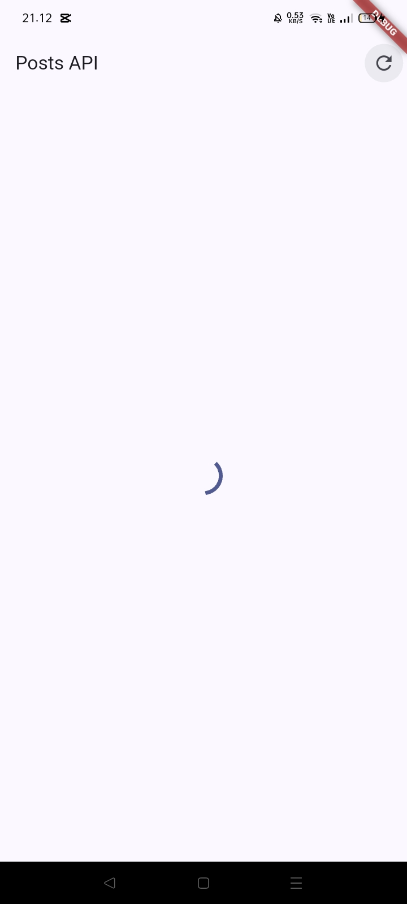 | 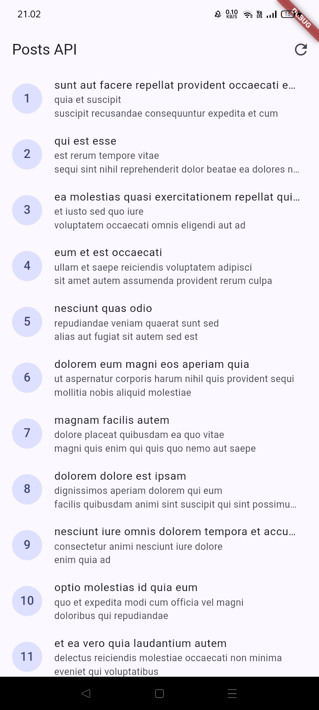 |

= Hasil pengamatan: Saat internet normal, aplikasi menampilkan loading terlebih dahulu. Setelah proses selesai, data berhasil diambil dari API dan menampilkan 100 posts.

2. Matikan internet (mode pesawat), tekan refresh, amati pesan ramah + tombol Coba lagi. Nyalakan kembali internet, tekan Coba lagi.

|                      Tampilan Mode Pesawat                      |                      Tampilan Internet Normal                      |
| :-------------------------------------------------------------: | :----------------------------------------------------------------: |
| 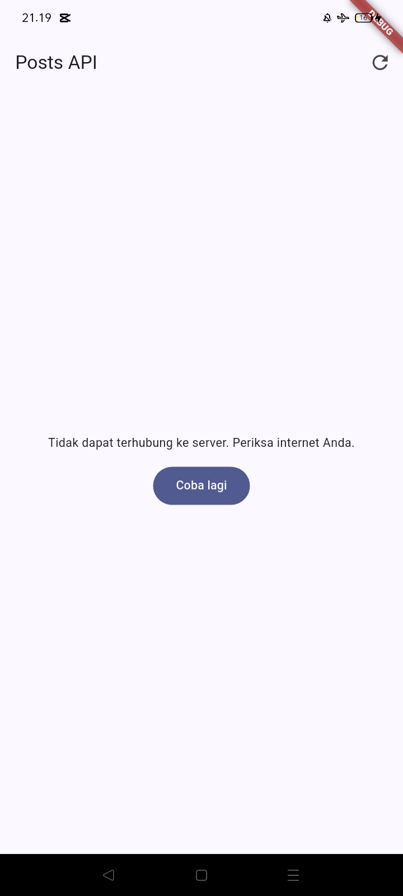 |  |

= Hasil pengamatan: Saat internet normal, aplikasi menampilkan loading lalu berhasil menampilkan 100 posts. Saat internet dimatikan, muncul pesan error dan tombol Coba lagi, kemudian data dapat dimuat kembali setelah internet aktif. Saat baseUrl diubah menjadi URL yang salah, aplikasi menampilkan pesan error koneksi.

3. Sementara ubah baseUrl menjadi URL salah, amati pesan error koneksi. Kembalikan setelah uji.

   Untuk pengujian ubah sementara menjadi URL yang salah seperti code di bawah ini:

   
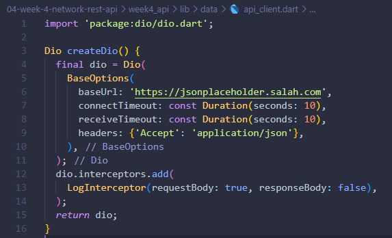
 

|                     Tampilan URL Salah                     |                            Tampilan URL Benar                             |
| :--------------------------------------------------------: | :-----------------------------------------------------------------------: |
|  |  |

= Hasil pengamatan: Saat baseUrl diubah menjadi URL yang salah, aplikasi menampilkan pesan error koneksi karena tidak dapat mengambil data dari API. Setelah baseUrl dikembalikan ke URL yang benar, data dapat dimuat kembali.

## Praktikum 3: Pagination dasar

1. Halaman 1 tampil dulu, awalnya muncul 10 post, jika melakukan scroll ke bawah muncul loading kecil lalu muncul data berikutnya otomatis muncul

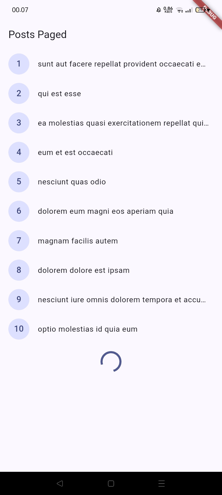

## AI Challenge

### AI Verification Checklist

Sebelum kode AI diterima, verifikasi hal berikut dan catat temuan Anda di README:

<li>Apakah UI memanggil Dio secara langsung (dilarang) atau lewat repository?

= UI tidak memanggil Dio langsung; melalui provider dan repository.

<li>Apakah fromJson aman null, atau masih memakai cast langsung yang bisa crash?

= fromJson aman terhadap field hilang/null.

<li>Apakah semua tipe DioExceptionType (timeout, connectionError, badResponse) dipetakan ke pesan pengguna?

= Timeout, connectionError, dan badResponse dipetakan ke pesan pengguna.

<li>Apakah baseUrl/timeout terpusat di satu client, bukan tersebar di tiap method?

= baseUrl dan seluruh timeout Dio dipusatkan di api_client.dart.

<li>Apakah test AI benar-benar menguji kasus field hilang, atau hanya happy path? Tambahkan minimal 1 edge case sendiri.

= Edge-case test Post.fromJson ditambahkan di comment_test.dart.

<li>Jalankan flutter analyze dan flutter test, apakah hasil AI lolos tanpa warning?

|                   Flutter Analyze                   |                 Flutter Test                  |
| :-------------------------------------------------: | :-------------------------------------------: |
| 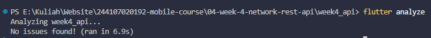 | 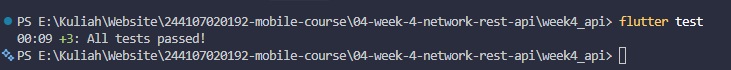 |

## Refactoring & Testing

### Refactoring Challenge

Lakukan refactoring berikut pada project API Anda, lalu commit dengan pesan yang jelas:

<li>Ekstrak widget baris post menjadi PostTile tersendiri agar ListView.builder pendek dan mudah diuji.

<li>Pindahkan friendlyErrorMessage ke file lib/data/network_errors.dart agar bisa dipakai ulang halaman paged dan non-paged.

<li>Tambahkan halaman detail post dengan GoRouter (/post/:id) yang menampilkan title dan body lengkap, state detail diambil dari list yang sudah dimuat atau via repository bila langsung dibuka.

|                   Halaman Show Data                   |                 Halaman detail Data                  |
| :-------------------------------------------------: | :-------------------------------------------: |
| 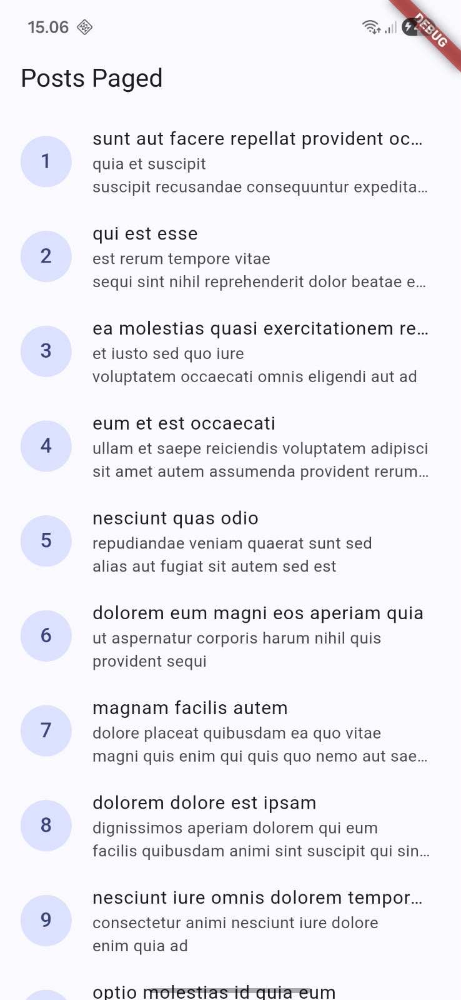 | 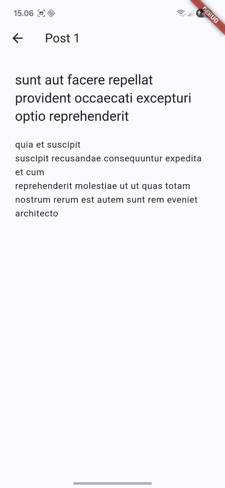 |

### Testing: unit test model + mock repository

|                   Flutter Analyze                   |                 Flutter Test                  |
| :-------------------------------------------------: | :-------------------------------------------: |
| 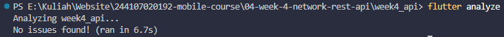 | 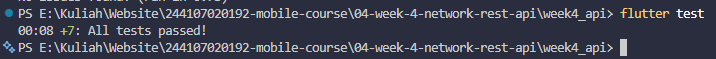 |

## CheckList verifikasi mandiri

|   |   |
|---|---|
| [✓] | UI tidak memanggil Dio langsung, semua akses data lewat repository + provider. |
| [✓] | Empat state tampil benar: loading, error (+ retry), empty, success. |
| [✓] | Pagination: data bertambah saat scroll, tidak ada request ganda, ada indikator akhir data. |
| [✓] | flutter analyze tanpa issue dan semua test lulus. |
| [✓] | Hasil AI diverifikasi dan didokumentasikan pada folder docs/. |
|   |   |

## Tugas, refleksi, dan referensi

## Mini project / Industry Challenge

### Hasil Implementasi

1. Halaman utama menampilkan daftar post dari REST API JSONPlaceholder dengan pagination 10 data per halaman, jika scroll maka akan muncul loading data.

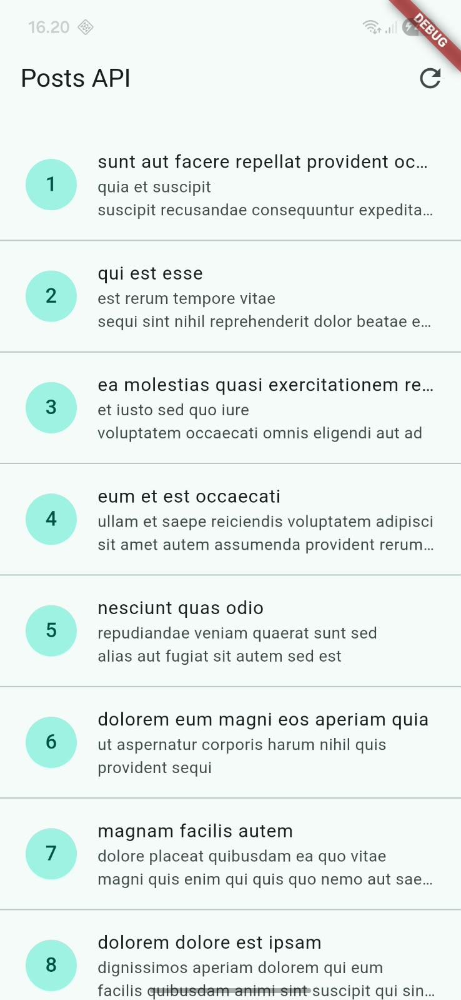

2. Pagination, memuat data berikutnya secara otomatis ketika pengguna melakukan scroll ke bawah. Setelah seluruh data berhasil dimuat, aplikasi menampilkan tulisan “Semua data telah termuat” dan tidak melakukan request tambahan.

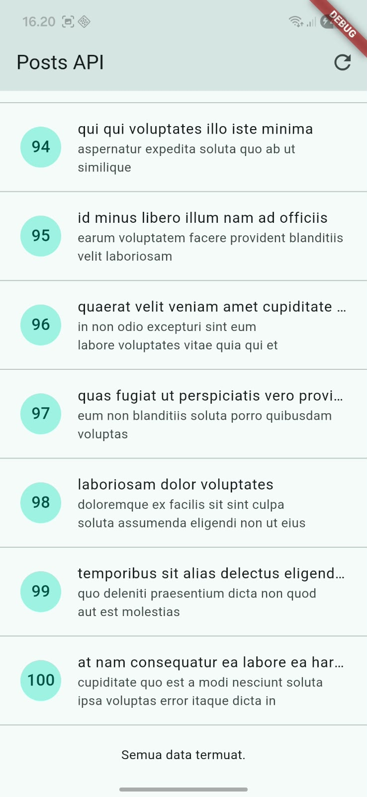

3. Error Handling, ketika terjadi error pada pada request, aplikasi menampilkan pesan error dan tombol Coba lagi.

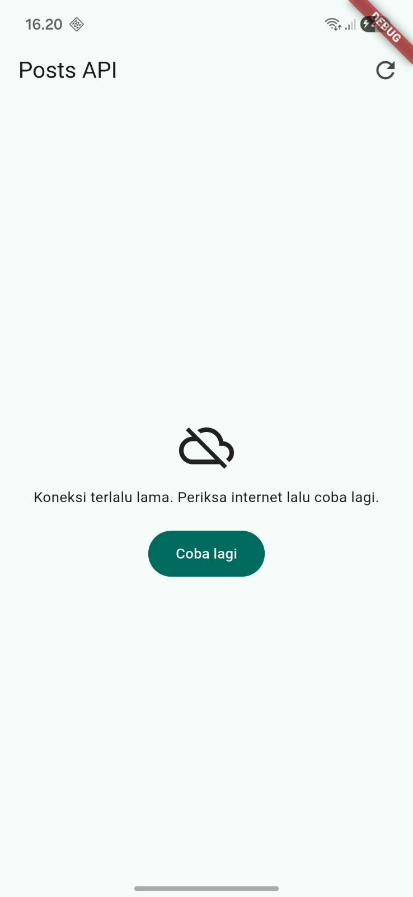

4. Pengujian dilakukan dengan menggunakan flutter test dan mencakup unit test model/error mapping serta provider test menggunakan repository palsu. 

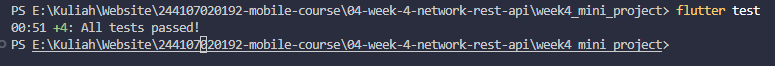

5. Dokumentasi AI Challenge berisi prompt yang digunakan, hasil dari AI, perbaikan yang dilakukan, serta alasan pemilihan solusi teknis. Dokumentasi disimpan di folder docs/.

## Refleksi

<li><b> Mengapa UI dilarang memanggil Dio langsung? Apa yang rusak jika aturan ini dilanggar?</b> 
Dio digunakan di repository supaya pengaturan API seperti baseUrl, timeout, dan interceptor cukup dibuat di satu tempat. Kalau Dio dipanggil langsung dari UI, kode jadi lebih susah saat mau testing atau ada perubahan API.</li>

<li><b> Kapan pagination client-side cukup, dan kapan harus mengandalkan pagination server (_page/_limit)?</b> 
Pagination client-side cukup untuk data yang sedikit. Jika data banyak, lebih baik menggunakan pagination server dengan _page dan _limit agar data diambil secara bertahap.</li>

<li><b> Bagaimana exception repository berubah menjadi AsyncError tanpa try/catch di setiap widget? Kapan try/catch eksplisit tetap dibutuhkan?</b> 
Riverpod bisa menangkap error dari repository dan mengubahnya menjadi AsyncError. Karena project ini memakai Notifier<PostsState>, try/catch digunakan untuk mengisi state.error dan tetap mempertahankan data yang sudah ada.</li>

<li><b> Bagian mana dari hasil AI yang Anda perbaiki, dan mengapa?</b> 
Hasil dari AI disesuaikan lagi dengan project yang dibuat. Beberapa bagian yang diperbaiki yaitu FamilyAsyncNotifier, timeout Dio, test bawaan Flutter, edge-case test, PostTile, network_errors.dart, provider test, dan guard pagination.</li>

