### NAMA : Wawa Elent Irawanti

### NIM : 244107020192

### KELAS : TI-3H

## Praktikum 1: SharedPreferences

|                Light Mode                 |                Dark Mode                |
| :---------------------------------------: | :-------------------------------------: |
| 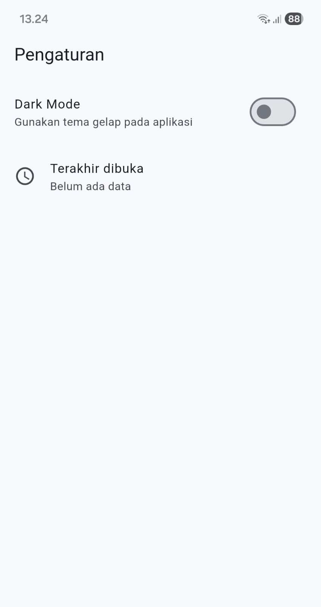 | 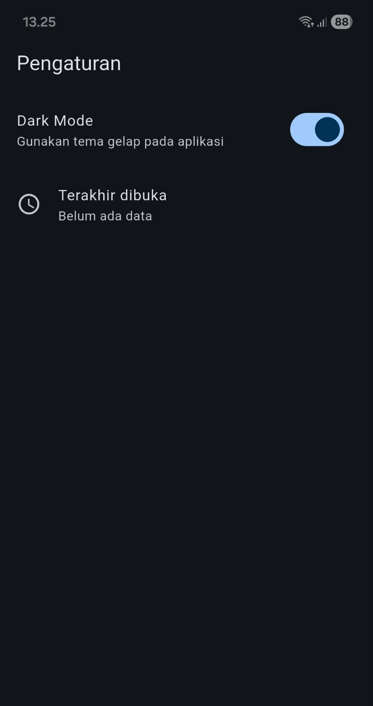 |

## Praktikum 2: SQLite dan repository catatan

|              Halaman Catatan Kosong               |              Halaman Daftar Catatan               |
| :-----------------------------------------------: | :-----------------------------------------------: |
| 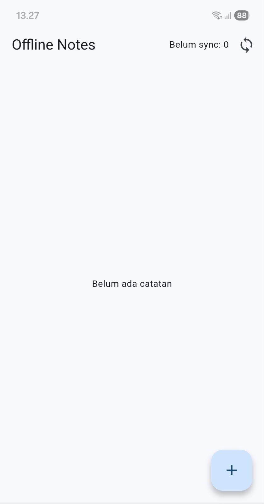 | 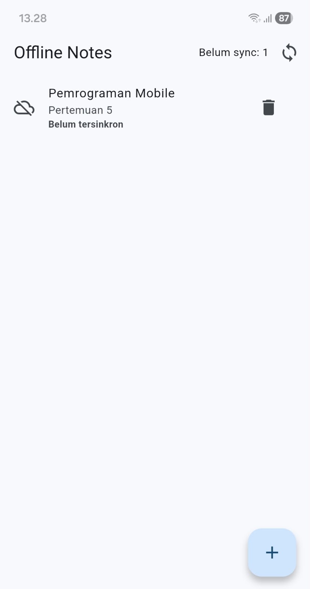 |

<li> Pada halaman catatan, pengguna dapat menambahkan catatan baru, melihat daftar catatan, dan menghapus catatan yang sudah tidak diperlukan. Catatan yang baru ditambahkan juga akan ditandai sebagai belum tersingkron.

## Praktikum 3: Cache-first dan antrean sync

 Pengujian dilakukan untuk memastikan aplikasi tetap dapat digunakan saat offline dan data dapat disinkronkan kembali saat koneksi tersedia. 

1. Sebelum Sinkronisasi

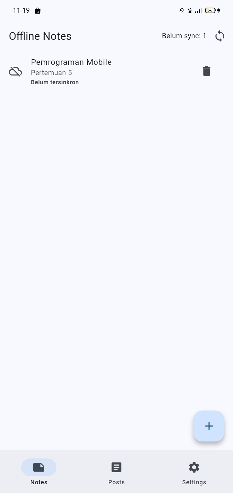

<li> Catatan tetap dapat ditampilkan saat offline dan masih memiliki status belum tersinkron.</li> 

2. Setelah Sinkronisasi

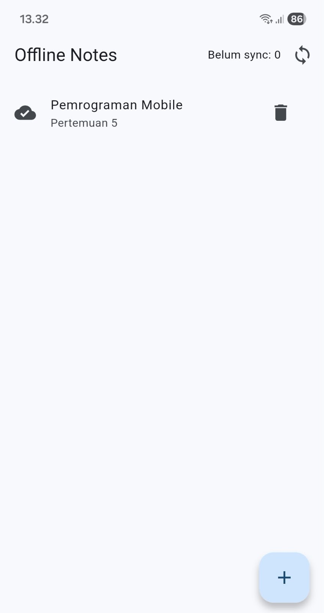

<li> nyalakan kembali koneksi internet, jalankan proses sync. Setelah dijalankan Catatan berhasil disinkronkan dan jumlah catatan yang belum tersinkron menjadi 0. </li> 

3. Cached Posts Online

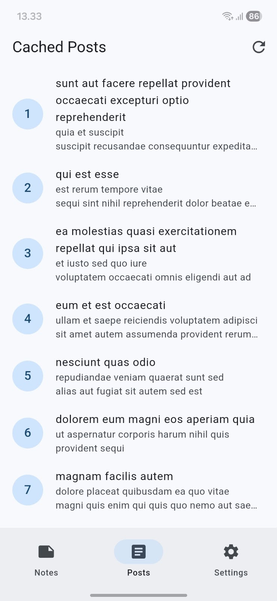

<li> Data posts berhasil ditampilkan dan disimpan sebagai cache lokal.</li> 

3. Cached Posts Offline

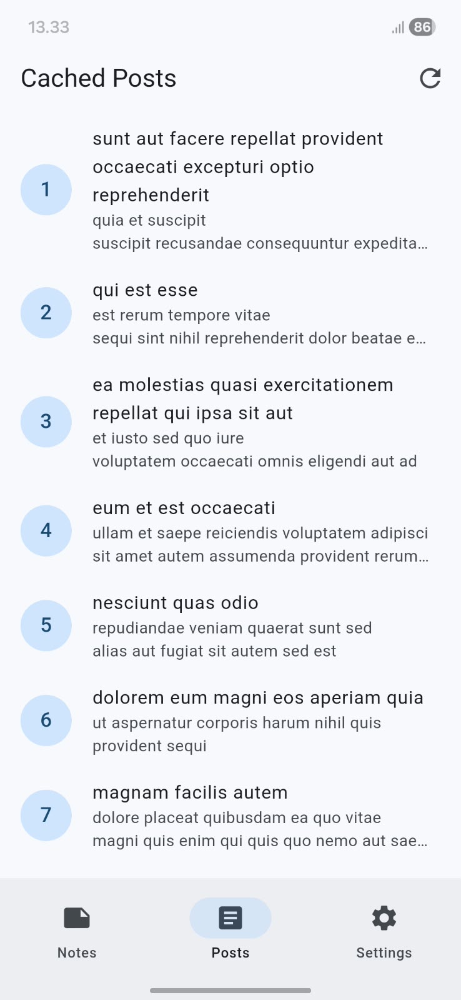

<li> Data posts yang sudah tersimpan di cache tetap dapat ditampilkan saat aplikasi offline.</li> 

## AI Challenge

### AI Verification Checklist

Sebelum kode AI diterima, verifikasi dan catat temuan Anda di README:

<li> Apakah AI menempatkan daftar catatan di SharedPreferences? (menolak: rapuh untuk koleksi).

= Tidak. SharedPreferences digunakan untuk menyimpan preferensi tema, sedangkan daftar catatan disimpan menggunakan sqflite karena catatan merupakan koleksi terstruktur.

<li> Apakah skema AI mendukung antrean sync (dirty flag / updated_at) atau hanya CRUD polos?

= Mendukung antrean sync dasar karena tabel notes memiliki updated_at dan dirty. Namun, penghapusan masih menggunakan hard-delete sehingga belum memiliki deleted_at/tombstone untuk sinkronisasi penghapusan.

<li> Apakah klaim "real-time" AI didukung stream (Drift/watch) atau hanya asumsi?

= Tidak real-time berbasis database. Daftar catatan saat ini menggunakan Future, bukan query stream, sehingga UI diperbarui melalui pemuatan ulang atau invalidation.

<li> Apakah estimasi boilerplate AI masuk akal setelah Anda mencoba instalasinya (flutter pub add + migrasi skema)?

= Untuk proyek ini, sqflite sudah digunakan dan berjalan. Drift dan Hive belum dipasang atau diuji, sehingga estimasi boilerplate keduanya belum dapat diverifikasi melalui instalasi langsung.

<li> Keputusan final Anda beserta alasannya, boleh berbeda dari rekomendasi AI selama berargumen.

= Menggunakan SharedPreferences untuk preferensi tema dan sqflite untuk catatan. SharedPreferences cocok untuk satu nilai sederhana seperti tema, sedangkan sqflite lebih sesuai untuk CRUD catatan, query, dan kebutuhan metadata sinkronisasi.

## Refactoring, testing, dan error umum

### Refactoring Challenge

Lakukan refactoring berikut pada project catatan Anda, lalu commit dengan pesan yang jelas:

<li> Ekstrak baris catatan menjadi widget NoteTile tersendiri yang menampilkan badge "belum tersinkron" bila dirty == true.

<li> Pindahkan logika cache posts dan syncNotes ke file lib/data/sync.dart agar repository tetap fokus pada CRUD.

<li> Tambahkan halaman detail catatan dengan GoRouter (/note/:id) yang membaca dari repository lokal, bukan dari state halaman list.   

1. NoteTile

<li>Widget <code>NoteTile</code> digunakan untuk menampilkan setiap catatan dan badge "Belum tersinkron" ketika <code>dirty == true</code>.</li> 

2. Cache Posts dan Sync

<li>Cache posts dan proses <code>syncNotes</code> dipisahkan ke file <code>lib/data/sync.dart</code>, sehingga repository tetap fokus pada CRUD.

3. Detail Catatan

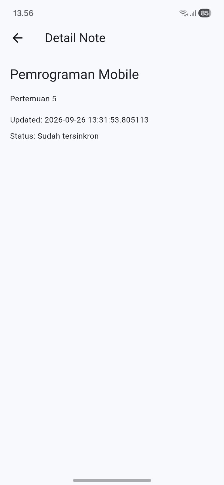

<li>Halaman detail catatan menggunakan GoRouter dengan route <code>/note/:id</code> dan mengambil data dari repository lokal.</li> 

### Testing: unit test model + repository palsu

|                   Flutter Analyze                   |                 Flutter Test                  |
| :-------------------------------------------------: | :-------------------------------------------: |
| 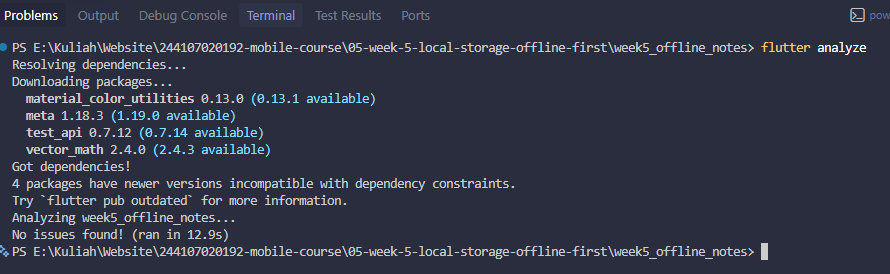 | 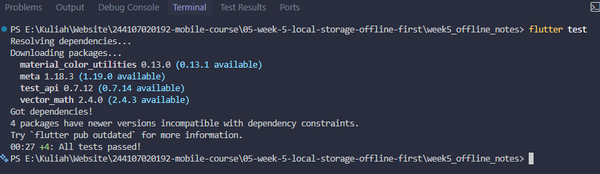 |

## CheckList verifikasi mandiri

|     |                                                                                          |
| --- | ---------------------------------------------------------------------------------------- |
| [✓] | UI tidak memanggil SQLite/SharedPreferences langsung; semua lewat repository + provider. |
| [✓] | Aplikasi penuh berfungsi dalam mode pesawat: baca, tambah, hapus catatan.                |
| [✓] | Badge dirty akurat sebelum/sesudah sync; cache posts tampil tanpa internet.              |
| [✓] | flutter analyze tanpa issue dan semua test lulus.                                        |
| [✓] | Hasil AI diverifikasi dan didokumentasikan pada folder docs/.                            |
|     |                                                                                          |

## Refleksi
 
<li><b>Mengapa daftar catatan tidak boleh disimpan di SharedPreferences? Apa yang rusak jika aturan ini dilanggar?</b>  
SharedPreferences cocok untuk menyimpan nilai sederhana seperti <code>dark_mode</code>, bukan daftar catatan. Jika catatan disimpan sebagai JSON, setiap perubahan harus membaca dan menulis ulang seluruh daftar sehingga kurang efisien dan sulit dikelola. Karena itu, catatan disimpan di SQLite.</li> 
 
<li><b>Kapan cache-first cukup, dan kapan membutuhkan strategi lain?</b>  
Cache-first cocok untuk data yang tidak harus selalu terbaru. Untuk data yang sering berubah seperti harga, lebih cocok menggunakan network-first agar data yang ditampilkan lebih baru, dengan cache sebagai cadangan jika internet gagal.</li> 
 
<li><b>Bagaimana dirty flag berubah menjadi antrean sync tanpa memblokir UI? Kapan tabel outbox diperlukan?</b>  
Saat catatan berubah, data disimpan ke SQLite dengan <code>dirty = 1</code> dan <code>updated_at</code>. Proses sync berjalan secara asynchronous sehingga UI tetap bisa digunakan. Setelah berhasil disinkronkan, <code>dirty</code> diubah menjadi 0. Tabel outbox diperlukan jika aplikasi membutuhkan antrean sync yang lebih kompleks seperti retry, urutan operasi, dan pencatatan error.</li> 
 
<li><b>Bagian mana dari rekomendasi AI yang ditolak, dan mengapa?</b>  
Saya menolak penggunaan SharedPreferences untuk daftar catatan karena tidak cocok untuk data koleksi. Saya juga menolak klaim bahwa aplikasi sudah real-time karena masih menggunakan <code>FutureProvider</code>, bukan stream seperti <code>watch()</code>. Saya memilih sqflite karena sudah cukup untuk kebutuhan CRUD dan sinkronisasi sederhana pada tugas ini.</li>