### NAMA : Wawa Elent Irawanti

### NIM : 244107020192

### KELAS : TI-3H

## Praktikum 1: Login + secure storage + token refresh

|                Login Page                 |                Home Page                |
| :---------------------------------------: | :-------------------------------------: |
| 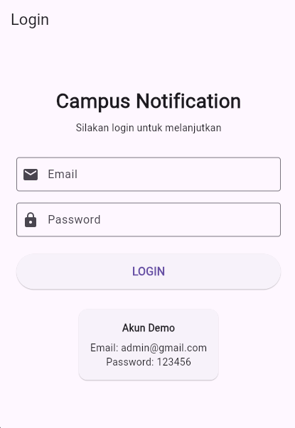 | 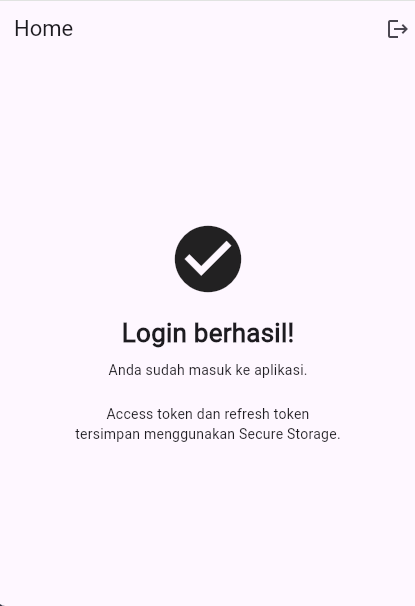 |

<li> Halaman Login digunakan untuk melakukan autentikasi menggunakan email dan password. Setelah berhasil, pengguna akan diarahkan ke halaman utama. Jika login gagal, sistem menampilkan pesan kesalahan dan pengguna tetap berada di halaman login.  </li> 

<li> Halaman Utama dapat diakses setelah login berhasil. Access token dan refresh token disimpan menggunakan secure storage, serta pengguna dapat melakukan logout untuk menghapus token dan kembali ke halaman login.  </li> 

## Praktikum 2: FCM, permission, dan token lifecycle

1. Notification Permission

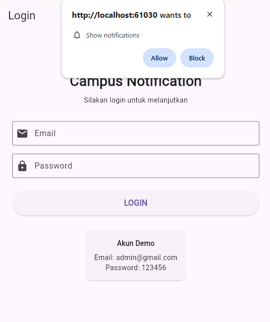

<li> Menampilkan permission notifikasi pada browser dan memastikan permission berhasil diberikan. </li> 

2. FCM Token

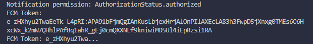

<li> Menampilkan FCM registration token yang berhasil diperoleh dari aplikasi Flutter. </li> 

3. Firebase Console Test Notification

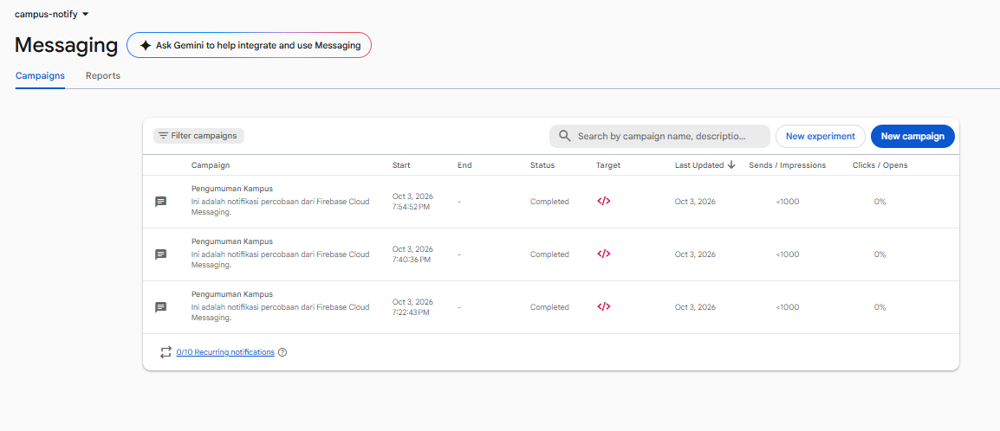

<li> Menampilkan campaign/test notification yang dibuat melalui Firebase Console. </li> 

4. Foreground Notification

<li> Notifikasi berhasil diterima ketika aplikasi Flutter sedang aktif/terbuka. </li> 

5. Background Notification

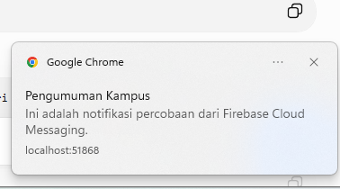

<li> Notifikasi berhasil diterima ketika aplikasi masih berjalan tetapi browser tidak sedang aktif digunakan. </li> 

6. Terminated Notification

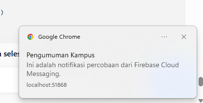

<li> Pengujian penerimaan notifikasi ketika halaman aplikasi Flutter sudah ditutup. </li> 

## Praktikum 3: Payload, tiga app state, klik dan topik

1. Notification dengan Payload Data

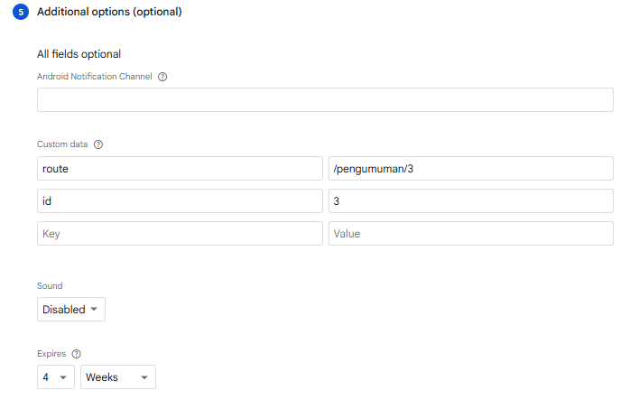

<li> Notification dikirim melalui Firebase Console dengan tambahan Custom Data berupa route dan id. </li> 

2. Notification Diterima

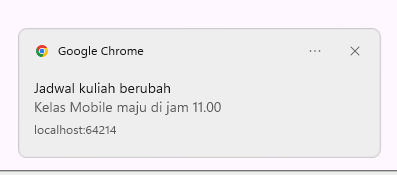

<li> Setelah notification dikirim melalui Firebase Console, notification berhasil diterima pada browser Chrome. </li> 

3. Navigation ke Halaman Pengumuman

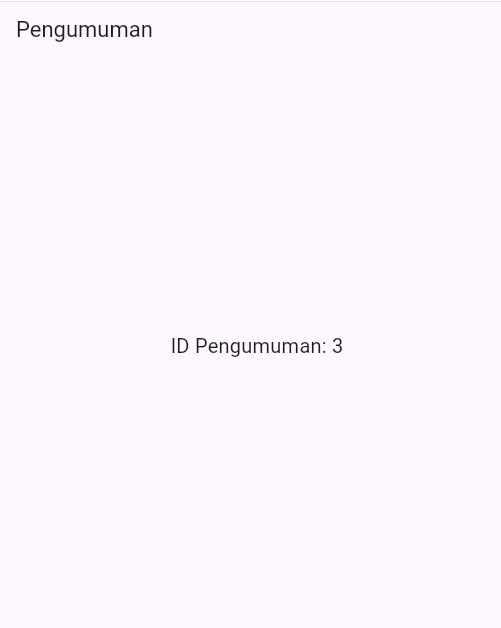

<li> Data route digunakan untuk menentukan halaman tujuan. Pada Flutter Web, route dapat diakses melalui /#/pengumuman/3. Halaman tujuan berhasil menampilkan ID pengumuman berdasarkan data id yang dikirim.</li> 

## AI Challenge

### AI Verification Checklist

- **Background handler top-level dengan `@pragma('vm:entry-point')`?** Ya. `firebaseMessagingBackgroundHandler` adalah fungsi top-level, bukan method kelas.
- **`onTokenRefresh` mengirim token baru ke backend?** Ya. Token saat ini dan token baru dikirim dengan `POST /devices`; bukan hanya dicetak ke log.
- **Foreground memakai local notification manual?** Ya. `onMessage` menampilkan notifikasi melalui `flutter_local_notifications`.
- **Klik dari foreground/background/terminated menuju rute yang benar?** Jalur dan tabel pengujian dicatat di [docs/ai-verification.md](./docs/ai-verification.md).
- **Token/secret di-hardcode atau di-log penuh?** Tidak. Token tidak di-hardcode atau dicetak. URL API dan VAPID key dikonfigurasi saat run; VAPID key adalah public key.
- **Keputusan final dan alasan teknis:** gunakan local notification manual agar notifikasi foreground konsisten dan tidak ada banner ganda di iOS; daftarkan token baru ke backend agar token lifecycle tersinkron. Detail platform, keputusan, dan bukti verifikasi: [docs/ai-verification.md](./docs/ai-verification.md).

## Refactoring, testing, dan error umum

### Refactoring Challenge

<li> Pindahkan semua string rute (/login, /pengumuman/:id) ke satu file lib/routes.dart agar deep link dari FCM dan GoRouter memakai konstanta yang sama.

<li> Ekstrak parsing RemoteMessage -> route ke fungsi murni routeFromMessage(Map<String, dynamic> data) agar bisa diunit-test tanpa Firebase.

<li> Pindahkan pemetaan DioException -> pesan ramah pengguna (401, timeout, offline) ke lib/data/api_errors.dart agar UI hanya menerima pesan, bukan exception mentah.   

1. Route Pengumuman 

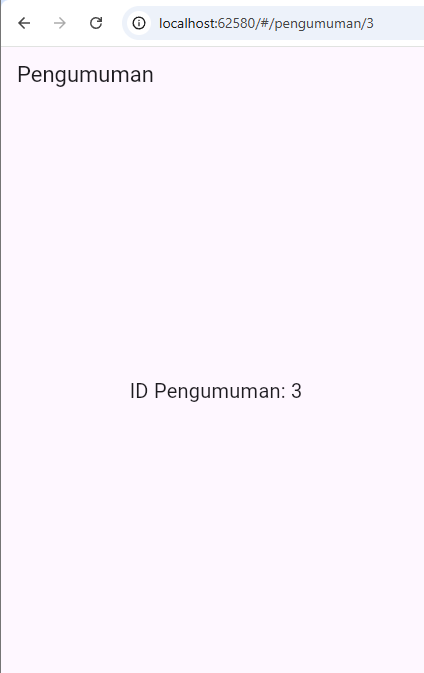

<li> Pengujian route /pengumuman/3 berhasil dan parameter ID berhasil diteruskan ke halaman pengumuman.</li> 

2. Refactoring Route 

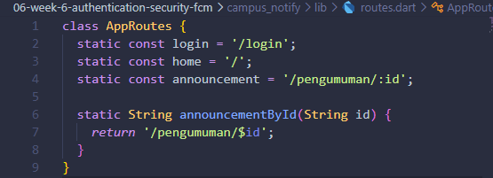

<li> Konstanta route aplikasi dipusatkan pada routes.dart agar route GoRouter dan deep link FCM menggunakan referensi yang sama.</li> 

3. Refactoring Parsing Route FCM

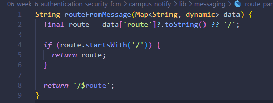

<li> Parsing route dari data FCM dipisahkan menjadi fungsi murni routeFromMessage() agar dapat diuji tanpa membutuhkan Firebase.</li> 

4. Refactoring API Erro

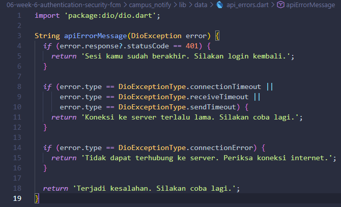

<li> Penanganan DioException dipisahkan dari UI sehingga error dapat diubah menjadi pesan yang lebih mudah dipahami pengguna.</li> 

5. Membuat Unit Test

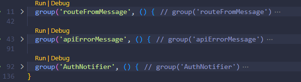

<li> Unit test Unit test dibuat pada test/auth_push_test.dart. Test ini digunakan untuk menguji parsing route FCM, pemetaan error API, dan status autentikasi berdasarkan access token.</li> 

### Testing: unit test tanpa Firebase sungguhan

|                   Flutter Analyze                   |                 Flutter Test                  |
| :-------------------------------------------------: | :-------------------------------------------: |
| 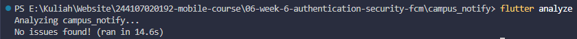 | 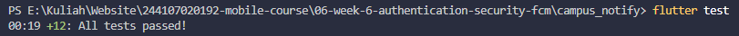 |

## CheckList verifikasi mandiri

|     |                                                                                          |
| --- | ---------------------------------------------------------------------------------------- |
| [✓] | Token hanya di flutter_secure_storage, tidak di SharedPreferences/log/screenshot penuh. |
| [✓] | 401 memicu refresh sekali lalu retry; refresh mati memaksa login ulang.                |
| [✓] | Ketiga app state teruji dengan tabel bukti; klik masuk ke rute yang benar.              |
| [✓] | Topik untuk broadcast, token untuk pesan personal.                                        |
| [✓] | flutter analyze bersih dan semua test lulus.                            |
|     |                                                                                          |

